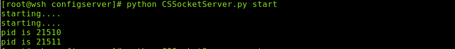

<h2>Table of Contents</h2>

<ul>
<li><a href="#orgheadline1">1. 软件简介</a></li>
<li><a href="#orgheadline3">2. 系统需求：</a>
<ul>
<li><a href="#orgheadline2">2.1. wshflask需求环境</a></li>
</ul>
</li>
<li><a href="#orgheadline11">3. 命令介绍</a>
<ul>
<li><a href="#orgheadline6">3.1. CSserver/NDserver</a>
<ul>
<li><a href="#orgheadline4">3.1.1. 启动方式</a></li>
<li><a href="#orgheadline5">3.1.2. 效果展示</a></li>
</ul>
</li>
<li><a href="#orgheadline10">3.2. wshflask</a>
<ul>
<li><a href="#orgheadline7">3.2.1. 启动方式</a></li>
<li><a href="#orgheadline8">3.2.2. 效果展示</a></li>
<li><a href="#orgheadline9">3.2.3. web界面展示</a></li>
</ul>
</li>
</ul>
</li>
<li><a href="#orgheadline28">4. 架构说明</a>
<ul>
<li><a href="#orgheadline14">4.1. 整体架构</a>
<ul>
<li><a href="#orgheadline12">4.1.1. 说明：</a></li>
<li><a href="#orgheadline13">4.1.2. 框架</a></li>
</ul>
</li>
<li><a href="#orgheadline18">4.2. 服务架构</a>
<ul>
<li><a href="#orgheadline15">4.2.1. nodeserver</a></li>
<li><a href="#orgheadline16">4.2.2. CSserver</a></li>
<li><a href="#orgheadline17">4.2.3. wshflask</a></li>
</ul>
</li>
<li><a href="#orgheadline27">4.3. 日志系统</a>
<ul>
<li><a href="#orgheadline19">4.3.1. 日志系统的作用</a></li>
<li><a href="#orgheadline22">4.3.2. 技术实现</a></li>
<li><a href="#orgheadline23">4.3.3. 日志系统的框架设计</a></li>
<li><a href="#orgheadline26">4.3.4. 日志系统的效果展示</a></li>
</ul>
</li>
</ul>
</li>
<li><a href="#orgheadline29">5. api</a></li>
<li><a href="#orgheadline30">6. 关于我</a></li>
</ul>

# 软件简介

这是一个类似nagios的服务器架构，有多节点(nodeserver)和一个配置服务器(CSServer),以及一个用户UI(wshflask)组成。

# 系统需求：

<table border="2" cellspacing="0" cellpadding="6" rules="groups" frame="hsides">

<colgroup>
<col  class="org-left" />

<col  class="org-left" />

<col  class="org-left" />
</colgroup>
<thead>
<tr>
<th scope="col" class="org-left">组件</th>
<th scope="col" class="org-left">需求</th>
<th scope="col" class="org-left">简介</th>
</tr>
</thead>

<tbody>
<tr>
<td class="org-left">系统</td>
<td class="org-left">linux</td>
<td class="org-left">&#xa0;</td>
</tr>

<tr>
<td class="org-left">python</td>
<td class="org-left">python2 且版本为python2.7</td>
<td class="org-left">目前能够保证在python2.6.6 和python2.7下正常运行</td>
</tr>

<tr>
<td class="org-left">expect</td>
<td class="org-left">linux系统软件</td>
<td class="org-left">可以通过 "yum install expect " 进行安装</td>
</tr>
</tbody>
</table>

## wshflask需求环境

依赖软件:

    主要是flask软件，有点多，以后更新

# 命令介绍

## CSserver/NDserver

### 启动方式

    1. CSSSocketerver启动命令
    python CSSocketServer.py debug/start/restart/stop 
    2. NDSocketServer启动命令
    python NDSocketServer.py debug/start/restart/stop

### 效果展示

1.  start命令

1.  stop命令

1.  restart命令

1.  debug命令

## wshflask

### 启动方式

    python manage.py runserver

### 效果展示

### web界面展示

# 架构说明

## 整体架构

### 说明：

1.  所有的查找都是基于 CSserver的
2.  任何的两台服务器之间都是可以通信的

### 框架

## 服务架构

### nodeserver

### CSserver

### wshflask

## 日志系统

### 日志系统的作用

日志可以分为三个部分：

1.  输出到屏幕上，用来作为debug
2.  输出到日志中，作为历史记录
3.  输出到远端，作为远端服务区的实时显示。

**NOTE：** 目前1 和2 放到了一起。

### 技术实现

1.  CSserver/NDserver

    1.  python的 logging实现 本地的屏幕和日志输出
    2.  利用multiprocessing 的Pipe实现日志的远端发送

2.  wshflask消息接受机制

    采用 js的 socket io 实现

### 日志系统的框架设计

### 日志系统的效果展示

1.  CSServer/NDserver端

2.  wshflask的实时显示

# api

CSsocketServer请参考：<doc/configserverdoc/_build/html/index.html>

NDSocketServer请参考：<doc/nodeserverdoc/_build/html/index.html>

# 关于我

linux运维开发

archlinux重度使用者

<872807604@qq.com>
